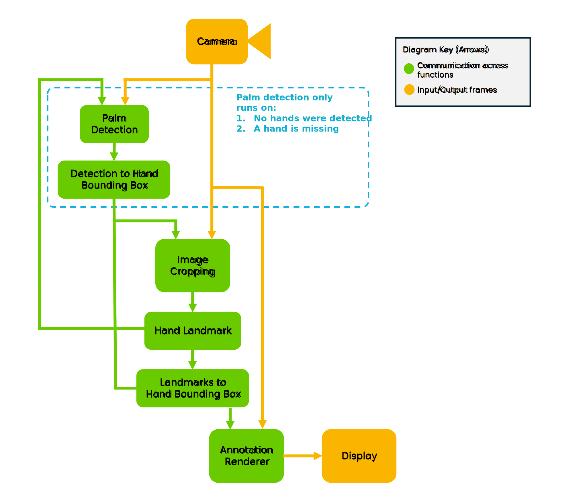
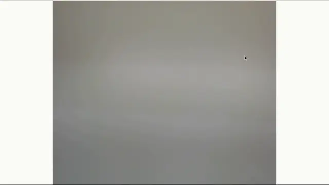

# i.MX Gesture Recognition

<!----- Boards ----->

NXP's *GoPoint for i.MX Applications Processors* unlocks a world of possibilities.
This user-friendly app launches pre-built applications packed with the Linux BSP, giving you
hands-on experience with your i.MX SoC's capabilities.
Using the i.MX 8M Plus or i.MX 93 EVKs you can run the included *i.MX Gesture Recognition*
application available on GoPoint launcher as apart of the BSP flashed on to the board.
For more information about GoPoint, please refer to
[GoPoint for i.MX Applications Processors User's Guide](https://www.nxp.com/IMXLINUX).

*i.MX Gesture Recognition* showcases the Machine Learning (ML) capabilities of the i.MX 93
and i.MX 8M Plus by leveraging the Neural Processing Unit (NPU) integrated into these SoCs
to accelerate two deep learning vision-based models. Working together, these models detect up to
two hands present in a scene and predict 21 3D keypoints per hand. These keypoints
are then processed by a Multi-Layer Perceptron (MLP) to recognize various hand signs
and finger gestures.

This application is developed using OpenCV and Python.

## Machine Learning Pipeline description

*i.MX Gesture Recognition* implements an ML pipeline that is composed by two stages:
- First, we run the palm detection model over the entire input frame, searching for
all palm instances. Then, by applying non-maximum suppression we can filter redundant
detections and return up to 2 palm instances. These palm detections are resized
to cover the entire hand and sent to the hand landmark model.

- The hand landmark model calculates the 21 3D hand landmarks, their score, and handedness (left or right).
If the score exceeds a threshold, we consider these detections as corrrect and
use them to calculate a new hand bounding box, eliminating the need to run
the palm detection model again until a hand is lost.

- Finally, these keypoints are processed by a Multi-Layer Perceptron (MLP) to
recognize various hand signs and finger gestures (Point, Close, and Open).

>**NOTE:** This block diagram is simplified and do not represent the complete
software architecture. Some elements were omitted and only the key elements are shown.

## Table of Contents
1. [Software](#1-software)
2. [Hardware](#2-hardware)
3. [Running Demo](#3-running-demo)
4. [FAQs](#4-faqs)
5. [Support](#5-support)
6. [Release Notes](#6-release-notes)

## 1. Software

*i.MX Gesture Recognition* is part of Linux BSP available at [Embedded Linux for i.MX Applications Processors](https://www.nxp.com/design/design-center/software/embedded-software/i-mx-software/embedded-linux-for-i-mx-applications-processors:IMXLINUX). All the required software and dependencies to run this
application are already included in the BSP.

i.MX Board          | Main Software Components
---                 | ---
**i.MX 8M Plus EVK** | OpenCV + Python VX Delegate (NPU)
**i.MX 93 EVK**      | OpenCV + Python Ethos-U Delegate (NPU)

### Models information

#### BlazePalm Detector (Full Version)

Information          | Value
---                  | ---
Input shape          | RGB image [1, 192, 192, 3]
Input value range    | [1.0, 0.0]
Output shape         | Undecoded palm bboxes location and keypoints: [1, 2016, 18]   Scores of detected bboxes: [1, 2016, 1]
File size (INT8)     | 1.4 MB
Source framework     | MediaPipe (TensorFlow Lite)
Target platform      | MPUs

#### Hand Landmark Model (Full Version)

Information          | Value
---                  | ---
Input shape          | RGB image [1, 224, 224, 3]
Input value range    | [1.0, 0.0]
Output shape         | Handedness: [1, 1]   Score: [1, 1]   Hand landmarks: [1, 63]   Hand landmarks (Real): [1, 63]
File size (INT8)     | 3.2 MB
Source framework     | MediaPipe (TensorFlow Lite)
Target platform      | MPUs

### Benchmarks

The quantized INT8 models have been tested on i.MX 8M Plus and i.MX 93 using `./benchmark_model` tool
(see [i.MX Machine Learning User's Guide](https://www.nxp.com/docs/en/user-guide/IMX-MACHINE-LEARNING-UG.pdf)).

#### BlazePalm Detector Performance (Full Version)

Platform    | Accelerator     | Avg. latency | Command
---         | ---             | ---          | ---
i.MX 8M Plus | CPU (1 thread)  | 245.62 ms    | ./benchmark_model --graph=palm_detection_full_quant.tflite
i.MX 8M Plus | CPU (4 threads) | 183.42 ms    | ./benchmark_model --graph=palm_detection_full_quant.tflite --num_threads=4
i.MX 8M Plus | NPU             |  16.75 ms    | ./benchmark_model --graph=palm_detection_full_quant.tflite --external_delegate_path=/usr/lib/libvx_delegate.so
i.MX 93      | CPU (1 thread)  | 202.58 ms    | ./benchmark_model --graph=palm_detection_full_quant.tflite
i.MX 93      | CPU (2 threads) | 175.54 ms    | ./benchmark_model --graph=palm_detection_full_quant.tflite --num_threads=2
i.MX 93      | NPU             |  11.49 ms    | ./benchmark_model --graph=palm_detection_full_quant_vela.tflite --external_delegate_path=/usr/lib/libethosu_delegate.so

#### Hand Landmark Model Performance (Full Version)

Platform    | Accelerator     | Avg. latency | Command
---         | ---             | ---          | ---
i.MX 8M Plus | CPU (1 thread)  |  83.48 ms    | ./benchmark_model --graph=hand_landmark_full_quant.tflite
i.MX 8M Plus | CPU (4 threads) |  21.87 ms    | ./benchmark_model --graph=hand_landmark_full_quant.tflite --num_threads=4
i.MX 8M Plus | NPU             |  7.06 ms    | ./benchmark_model --graph=hand_landmark_full_quant.tflite --external_delegate_path=/usr/lib/libvx_delegate.so
i.MX 93      | CPU (1 thread)  |  44.27 ms    | ./benchmark_model --graph=hand_landmark_full_quant.tflite
i.MX 93      | CPU (2 threads) |  23.86 ms    | ./benchmark_model --graph=hand_landmark_full_quant.tflite --num_threads=2
i.MX 93      | NPU             |   3.89 ms    | ./benchmark_model --graph=hand_landmark_full_quant_vela.tflite --external_delegate_path=/usr/lib/libethosu_delegate.so

>**NOTE:** Evaluated on BSP LF-6.12.3_1.0.0.

>**NOTE:** If you are building the BSP using Yocto Project instead of downloading the pre-built BSP, make sure
the BSP is built for *imx-image-full*, otherwise GoPoint is not included. Machine learning software is only
available in *imx-image-full*.

## 2. Hardware

To test *i.MX Gesture Recognition*, either the i.MX 8M Plus or i.MX 93 EVKs are required with their respective hardware components.

Component                                         | i.MX 8M Plus        | i.MX 93
---                                               | :---:              | :---:
Power Supply                                      | :white_check_mark: | :white_check_mark:
HDMI Display                                      | :white_check_mark: | :white_check_mark:
USB micro-B cable (Type-A male to Micro-B male)   | :white_check_mark: |                   
USB Type-C cable  (Type-A male to Type-C male)    |                    | :white_check_mark:
HDMI cable                                        | :white_check_mark: | :white_check_mark:
IMX-MIPI-HDMI (MIPI-DSI to HDMI adapter)          |                    | :white_check_mark:
Mini-SAS cable                                    |                    | :white_check_mark:
USB camera                                        | :white_check_mark: | :white_check_mark:
Mouse                                             | :white_check_mark: | :white_check_mark:

## 3. Running Demo

When *i.MX Gesture Recognition* starts running, the following elemets appear on the display:

1. When a hand is detected, it is enclosed in a green bounding box.
2. Twenty-one hand keypoints are rendered over the detected hand.
3. Near the wirst, the handedness (left or right) is displayed along with the recognized
   gesture type: **Close**, **Open** or, **Point**. If the gesture does not match any of these,
   it is labeled as **Unknown**.

## 4. FAQs

### The GTK+3 GUI windows close unexpectedly when running the application

This is a known issue and we are working on it. Sometimes the windows close unexpectedly. If this happens,
please relaunch the application. Most of the times this does not affect the execution of the application.

### Models are failing to download from server

Please make sure the internet connection is up and running on the board. The application requires an internet connection
to download the models. If internet connection is available, please update the time and date of the board before
trying to download the models again. Some servers might block the downloads for security reasons when the time and date
of board is not updated. Some companies might also block their networks preventing the models to be downloaded; if
this is the case, try using another connection such as a mobile device working as hotspot (Wi-Fi connection is required).

### Files are corrupted

It is possible that files get corrupted during download process due to different reasons, such as a connection shutdown.
If this happens, the files won't be loaded to the application. To fix this, the easy solution is to clean the following
path on the board: `/root/gopoint-apps/downloads`. Remove all files and try running the application again. If lucky, the
files will be downloaded successfully next time.

### Device not compatible or not working

This is caused if the camera being used is not correctly selected in the drop-down menu list. Try selecting another
source.

## 5. Support
>**Warning**: For more general technical questions, enter your questions on the [NXP Community Forum](https://community.nxp.com/)

## 6. Release Notes

Version | Description                         | Date
---     | ---                                 | ---
1.0.0   | Initial release                     | June 30th 2025

## Licensing

*i.MX Gesture Recognition* is licensed under the [Apache-2.0 License](https://www.apache.org/licenses/LICENSE-2.0).

## Origin

[1] Zhang, F., Bazarevsky, V., Vakunov, A., Tkachenka, A., Sung, G., Chang, C. L., & Grundmann, M. (2020). Mediapipe hands: On-device real-time hand tracking. arXiv preprint arXiv:2006.10214.

Model card: https://drive.google.com/file/d/1-rmIgTfuCbBPW_IFHkh3f0-U_lnGrWpg/preview

MediaPipe models are licensed under [Apache-2.0 License](https://www.apache.org/licenses/LICENSE-2.0.html).