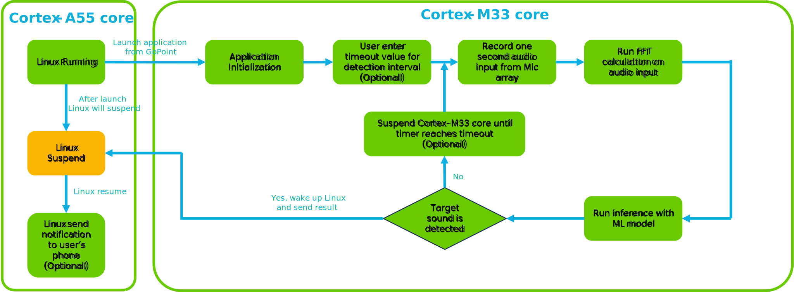
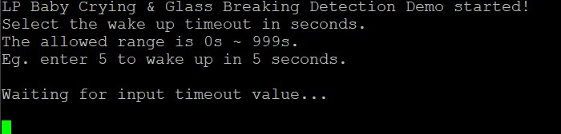
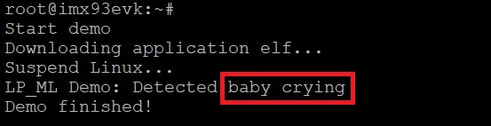
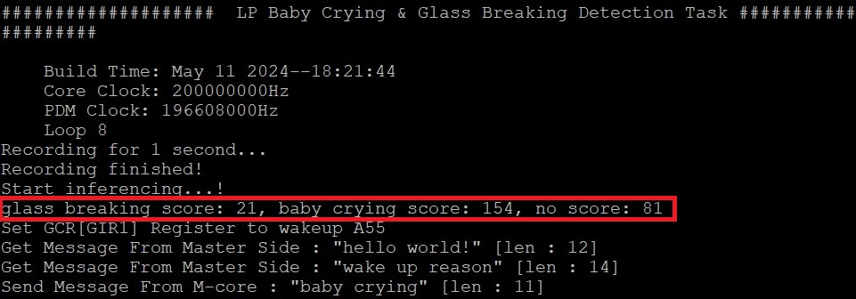
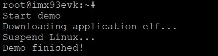
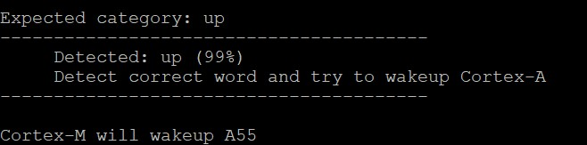
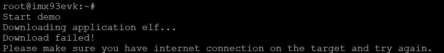
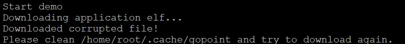

# i.MX 93 Low Power Machine Learning

<!----- Boards ----->

 

NXP's *GoPoint for i.MX Applications Processors* unlocks a world of possibilities. This user-friendly app launches
pre-built applications packed with the Linux BSP, giving you hands-on experience with your i.MX SoC's capabilities.
Using the i.MX 93 EVKs you can run the included *Low Power Baby Crying/Glass Breaking Detection* and *Low Power Key Word Spot (KWS) Detection* application available on GoPoint
launcher as apart of the BSP flashed on to the board. For more information about GoPoint, please refer to
[GoPoint for i.MX Applications Processors User's Guide](https://www.nxp.com/IMXLINUX).

This Low Power Machine Learning (ML) application showcases the i.MX 93's machine learning capabilities in low power use
case by using Cortex-M33 core to run ML model inference with tflite-micro framework. When running the application, the
Cortex-A55 core, which runs Linux, will be put into suspend mode to save power consumption. NPU is not used in this
application for the same reason. 

## Table of Contents

1. [Software Architecture](#1-software-architecture)
2. [ML Models](#2-ML-models)
3. [Hardware](#3-hardware)
4. [Setup](#4-setup)
5. [Results](#5-results)
6. [FAQs](#6-faqs) 
7. [Support](#7-support)
8. [Revision History](#8-revision-history)

## 1 Software Architecture

*i.MX 93 Low Power Machine Learning* runs on Cortex-M33 core, and do inference based on one secords audio recording from microphone array on the EVK board. The simplied block diagram of work follow is shown below.

>**NOTE:** For *Low Power Baby Crying/Glass Breaking Detection* application, users need to enter timeout value for the timer used to wakeup Cortex-M33 core, so that Cortex-M33 core can enter suspend in the interval between each detection to save power. For *Low Power KWS Detection* application, this step is skipped and there is no interval between each detection.

>**NOTE:** For *Low Power Baby Crying/Glass Breaking Detection* application, after Linux is woken up, example code has been implemented to show how to send notification with detection result to the user's phone. But this feature will not be demonstrated in this release since that requires user's Android phone to install additional App.

## 2 ML Models

For *Low Power Baby Crying/Glass Breaking Detection* application, the ML model takes audio data after Fast Fourier Transform(FFT) as input, and output the confidence of 3 classes: "baby crying", "glass breaking" and "silence".
For *Low Power KWS Detection* application, the ML model takes Mel Frequency Cepstrum Coefficient (MFCC) of audio data as input, and output the confidence of 12 classes: "down", "go", "left", "no", "off", "on", "right", "stop", "up", "yes", "Silence" and "Unknown".

More details about each model is listed below.

### Baby Crying/Glass Breaking Detection model

Information          | Value | Comment
---                  | ---   | ---
Input shape          | [1, 49, 64, 1] | FFT of audio data (quantized)
Input value range    | [-128, 127] | Int8
Output shape         | [1, 3] | Confidence of classes
MACs                 | 251.52 K
File size (INT8)     | 12 KB
Source framework     | [TensorFlow](https://www.tensorflow.org/tutorials/audio/simple_audio)
Origin               | Trained by NXP

### Low Power KWS Detection model

Information          | Value | Comment
---                  | ---   | ---
Input shape          | [1, 49, 10, 1] | MFCC of audio data
Input value range    | [-1.0, 1.0] | Float32
Output shape         | [1, 12] | Confidence of classes
MACs                 | 2.656 M
File size (INT8)     | 48 KB
Source framework     | [ARM-software](https://github.com/ARM-software/ML-KWS-for-MCU/tree/master)
Origin               | [DS_CNN_S.pb](https://github.com/ARM-software/ML-KWS-for-MCU/blob/master/Pretrained_models/DS_CNN/DS_CNN_S.pb)

### Benchmarks

The inference time on Cortex-M33 core is measured directly in application using *SysTick*. The inference time on Cortex-A55 is measured using `./benchmark_model` tool and listed here as reference.

>**NOTE:** Evaluated with MCUXpresso SDK 2.14.2 and BSP LF-6.6.3_1.0.0 on i.MX 93 EVK board

#### Baby Crying/Glass Breaking Detection model

CPU         | CPU Freq | Avg. Inference Time
---         | ---      | ---
Cortex-M33  | 200MHz   | 12 ms
Cortex-A55  | 1690MHz  | 0.508 ms

#### Low Power KWS Detection model

CPU         | CPU Freq | Avg. Inference Time
---         | ---      | ---
Cortex-M33  | 200MHz   | 204 ms
Cortex-A55  | 1690MHz  | 1.632 ms

## 3 Hardware

To run *Low Power Baby Crying/Glass Breaking Detection* and *Low Power KWS Detection* application on i.MX 93 EVK board, following hardware components are required.

Component |
---
Power Supply                
USB Type-C cable  (Type-A male to Type-C male)
HDMI Display (optional) 
HDMI cable (optional)
IMX-MIPI-HDMI (MIPI-DSI to HDMI adapter, optional)
Mini-SAS cable (optional)
Mouse (optional)

## 4 Setup

>**NOTE:** To run *Low Power Baby Crying/Glass Breaking Detection* application or *Low Power KWS Detection* application, users need to append **'clk_ignore_unused'** in u-boot's 'mmcargs' env before booting linux

Launch GoPoint on the board and click on the **LP Baby Cry Detection** application or **LP KWS Detection** application shown in the launcher menu. Select the **Launch Demo** button to start it. Users can check the introduction shown in the launcher menu to understand the work process of each application.

Once the process starts, it first downloads application elf file from GoPoint github repository. If downloading is successful, elf file is loaded into Cortex-M33 TCM to start the application, and Linux enters suspend mode.

For *Low Power Baby Crying/Glass Breaking Detection* application, after application finish initialization, users need to enter the timeout value for the timer used to wakeup Cortex-M33 core, so that Cortex-M33 core can enter suspend in the interval between each detection to save power. If users prefer no interval between each detection, then just enter 0 for the timeout value.

After timemout value is set, the application starts to record audio and run ML model inference on it. If the audio sound is detected as baby crying or glass breaking, the application wakes up Cortex-A55 core and send the result to Linux through *rpmsg-tty*. After Linux is woken up, it can further send notification to users' phone if needed.

For *Low Power KWS Detection* application, after application finish initialization, it starts record audio and run ML model inference on it. If the key word "up" is detected, the application wakes up Cortex-A55 core and Linux resumes from suspend mode.

## 5 Results

If *Low Power Baby Crying/Glass Breaking Detection* application runs successfully, following log should be printed in the Linux console. Users can get the detection result from the log.

In the Cortex-M33 console, after users enter timeout value, 
the inference result for each recording is printed in the console. If the score of *baby crying* or *glass breaking* is higher than *silence*, it wakes up Cortex-A55 core and send the result to Linux through *rpmsg-tty* as following shows.

If *Low Power KWS Detection* application runs successfully, following log should be printed in the Linux console.

In the Cortex-M33 console, the inference result for each recording is printed in the console. If the score of key word "up" is higher than the one of any other classes, it wakes up Cortex-A55 core as following shows.

## 6 FAQs

### How much power can be saved by running on Cortex-M33 core?

For the same use case (audio recording + ML model inference) running in Linux, the average power consumption of GROUP_SOC_FULL measured on i.MX 93 EVK board is 610 mW, while the average power consumption of Cortex-M33 core is 150 mW. Thus running such use case on Cortex-M33 core indeed brings advantage in power consumption.

>**NOTE:** The power consumption data may vary with test environment and condition. The data listed above is only used as reference to show the power advantage of using Cortex-M33 core. For more details of i.MX 93 power consumption, please refer to [i.MX 93 Power Consumption Measurement](https://www.nxp.com/docs/en/application-note/AN13917.pdf)

### How to get source code of the application and compile?

 The source code is released in patch format in [GitHub - nxp-imx-support/nxp-demo-experience-assets](https://github.com/nxp-imx-support/nxp-demo-experience-assets) under `patches` folder. To build the elf file of application, please follow below steps:

1. Generate and download i.MX 93's Cortex-M33 SDK from [MCUXpresso](https://mcuxpresso.nxp.com/). Please select i.MX 93
EVK as board, 2.14.2 as SDK version, Linux as Host OS and ARM GCC as Toolchain.

2. Unpack i.MX 93's Cortex-M33 SDK package on Linux Host PC and setup toolchain according to the user's guide in SDK
package. Then use `git init` to initialize git environment in the unpacked SDK folder for patch applying.

3. Download the patch "*0001-Add-low-power-baby-cry-detection-demo.patch*" and "*0001-Add-low-power-kws-detection-demo.patch*"
from [GitHub - nxp-imx-support/nxp-demo-experience-assets](https://github.com/nxp-imx-support/nxp-demo-experience-assets)
under `patches` folder. Then apply these two patches in the i.MX 93's Cortex-M33 SDK folder.

4. Move to folder `M33_SDK/boards/mcimx93evk/demo_apps/lp_baby_detection/armgcc/` and run `build_release.sh` script to build Cortex-M33 image for *Low Power Baby Crying/Glass Breaking Detection* application. Move to folder `M33_SDK/boards/mcimx93evk/demo_apps/lp_kws_detection/armgcc/` and run `build_release.sh` script to build Cortex-M33 image for *Low Power KWS Detection* application.

### Fail to download application ELF file from server

Please make sure the internet connection is working on the board. The application requires an internet connection to download the models. If internet connection is available, please update the time and date of the board before trying to download the models again. Some servers might block the downloads for security reasons when the time and date of board is not updated. Some companies might also block their networks preventing the models to be downloaded. If this is the case, try using another connection such as a mobile device working as hotspot (Wi-Fi connection is required).

### Files are corrupted

It is possible that files get corrupted during download process due to different reasons, such as a connection shutdown. If this happens, the files won't be loaded to the application. To fix this, the easy solution is to clean the following path on the board: `/root/gopoint-apps/downloads`. Remove all files and try running the application again. If lucky, the files will be downloaded successfully next time.

## 7 Support

For more general technical questions, enter your questions on the [NXP Community Forum](https://community.nxp.com/)

## 8 Revision History

Version | Description                         | Date
---     | ---                                 | ---
1.0.0   | Initial release                     | June 28th 2024

## Licensing

*i.MX 93 Low Power Machine Learning* is licensed under the [BSD-3-Clause License](https://spdx.org/licenses/BSD-3-Clause.html).

Models used in this application are licensed under [Apache-2.0 License](https://www.apache.org/licenses/LICENSE-2.0.html).