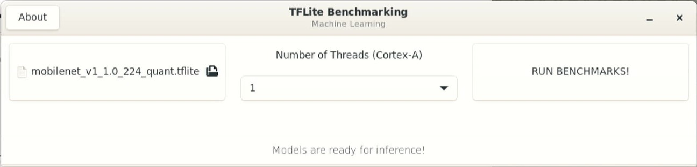
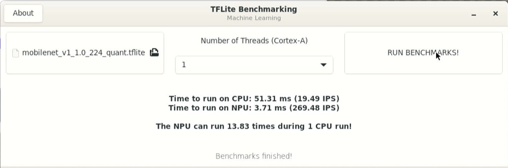
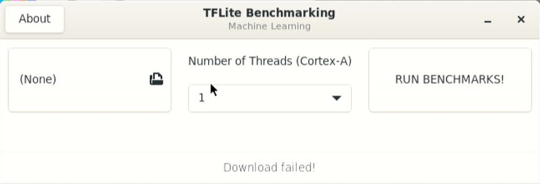
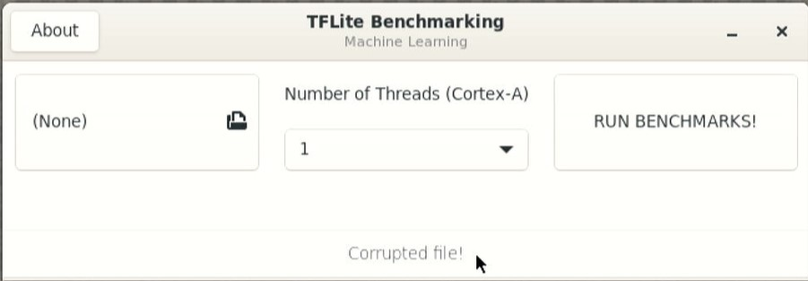

# ML Benchmark Tool

<!----- Boards ----->

 

NXP's *GoPoint for i.MX Applications Processors* unlocks a world of possibilities. This user-friendly app launches pre-built applications packed with the Linux BSP, giving you hands-on experience with your i.MX SoC's capabilities. Using the supported i.MX boards you can run the included *ML Benchmark* tool available on GoPoint launcher as apart of the BSP flashed on to the board. For more information about GoPoint, please refer to [GoPoint for i.MX Applications Processors User's Guide](https://www.nxp.com/IMXLINUX).

*ML Benchmark* tool allows to easily compare the performance of TensorFlow Lite models running on CPU (Cortex-A) and NPU, without the need to type in any command.

## Table of Contents

1. [Software](#1-software)
2. [Hardware](#2-hardware)
3. [Setup](#3-setup)
4. [Results](#4-results)
5. [FAQs](#5-faqs)
6. [Support](#6-support)
7. [Release Notes](#7-release-notes)

## 1 Software

*ML Benchmark* tool is part of Linux BSP available at [Embedded Linux for i.MX Applications Processors](https://www.nxp.com/design/design-center/software/embedded-software/i-mx-software/embedded-linux-for-i-mx-applications-processors:IMXLINUX). All the required software and dependencies to run this application are already included in the BSP.

i.MX Board        | Main Software Components
---               | ---
**i.MX 8M Plus**  | eIQ Software Stack (TensorFlow Lite RT) VX Delegate (NPU)     
**i.MX 93**       | eIQ Software Stack (TensorFlow Lite RT) Ethos-U Delegate (NPU)
**i.MX 95**       | eIQ Software Stack (TensorFlow Lite RT) Neutron Delegate (NPU)

## 2 Hardware

### Supported backends for ML inference:

The following i.MX EVKs support ML Benchmark:

* i.MX 8M Plus
* i.MX 93
* i.MX 95 

To test *ML Benchmark* you will need the following hardware:

* i.MX EVK for selected SoC
* Mouse
* HDMI Monitor or supported display

## 3 Setup

### Launching ML Benchmark tool

Launch GoPoint on the board and click on the *ML Benchmark* application shown in the launcher menu. Select the **Launch Demo** button to start it. A window shows up to let the user select the number of threads from Cortex-A to be used. Once selected in the drop-down menu, start the application by clicking **RUN BENCHMARKS!**.

When running the application on i.MX 8M Plus and i.MX 95, a warm-up time is needed for models to be ready for acceleration on the NPU. On i.MX 93, the models are compiled using vela compiler for Ethos-U NPU acceleration. The process is done automatically, but takes a couple of minutes on each board.

>**NOTE:** Cache is currently not enabled in i.MX 95. Every time this application is executed, the warm up time is required.

>**NOTE for i.MX 95:** Currently, i.MX 95 only supports benchmark of default model.

## 4 Results

When *ML Benchmark* starts running, the following is seen on display:

1. The display shows "Running CPU model" then "Running NPU model" and finally "Benchmarks finished" with its results:

## 5 FAQs

### The GTK+3 GUI windows close unexpectedly when running the application

This is a known issue and we are working on it. Sometimes the windows close unexpectedly. If this happens, please relaunch the application. Most of the times this does not affect the execution of the application.

### Models are failing to download from server

Please make sure the internet connection is up and running on the board. The application requires an internet connection to download the models. If internet connection is available, please update the time and date of the board before trying to download the models again. Some servers might block the downloads for security reasons when the time and date of board is not updated. Some companies might also block their networks preventing the models to be downloaded; if this is the case, try using another connection such as a mobile device working as hotspot (Wi-Fi connVection is required).

### Files are corrupted

It is possible that files get corrupted during download process due to different reasons, such as a connection shutdown. If this happens, the files won't be loaded to the application. To fix this, the easy solution is to clean the following path on the board: `/root/gopoint-apps/downloads`. Remove all files and try running the application again. If lucky, the files will be downloaded successfully next time.

## 6 Support

Questions regarding the content/correctness of this example can be entered as Issues within this GitHub repository.

>**Warning**: For more general technical questions, enter your questions on the [NXP Community Forum](https://community.nxp.com/)

## 7. Release Notes

Version | Description                         | Date
---     | ---                                 | ---
1.0.0   | Initial release                     | December 16th 2024

## Licensing

*ML Menchmark* is licensed under the [Apache-2.0 License](https://www.apache.org/licenses/LICENSE-2.0).