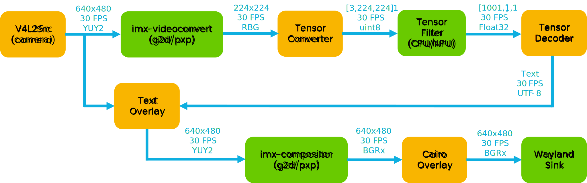
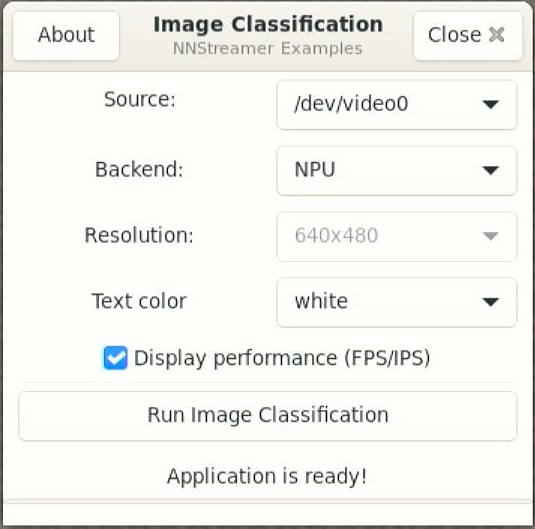
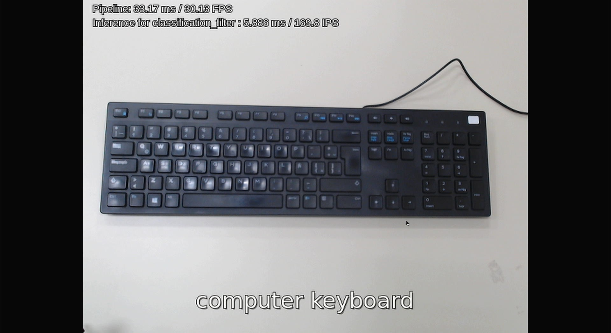
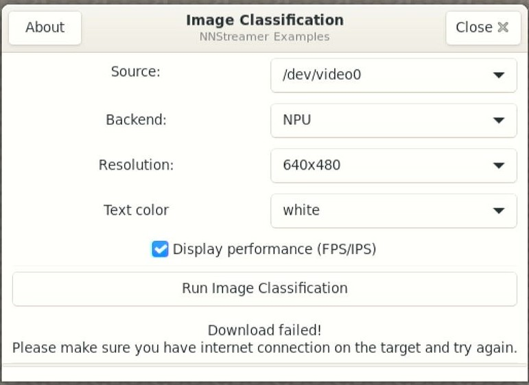
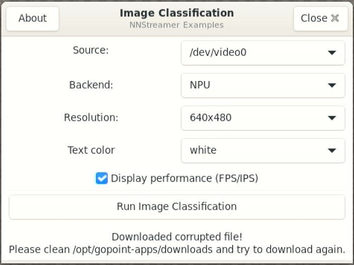

# Image Classification - NXP NNStreamer Example


<!----- Boards ----->

[](./BSD-3-Clause.txt)
[](./)
[](https://www.nxp.com/pip/8MPLUSLPD4-EVK)
[](https://www.nxp.com/products/processors-and-microcontrollers/arm-processors/i-mx-applications-processors/i-mx-9-processors/i-mx-93-applications-processor-family-arm-cortex-a55-ml-acceleration-power-efficient-mpu:i.MX93)
[](https://www.nxp.com/products/processors-and-microcontrollers/arm-processors/i-mx-applications-processors/i-mx-9-processors/i-mx-95-applications-processor-family-high-performance-safety-enabled-platform-with-eiq-neutron-npu:iMX95)
[](https://www.nxp.com/pip/8MMINILPD4-EVK)
[](https://www.nxp.com/pip/MCIMX8QM-CPU)
[](https://www.nxp.com/docs/en/user-guide/IMX-MACHINE-LEARNING-UG.pdf)

NXP’s *GoPoint for i.MX Applications Processors* unlocks a world of
possibilities. This user-friendly app launches pre-built applications
packed with the Linux BSP, giving you hands-on experience with your i.MX
SoC’s capabilities. Using the supported i.MX boards you can run the
included *Image Classification* example available on GoPoint launcher as
apart of the BSP flashed on to the board. For more information about
GoPoint, please refer to [GoPoint for i.MX Applications Processors
User’s Guide](https://www.nxp.com/IMXLINUX).

*Image Classification* showcases the *Machine Learning* (ML)
capabilities of i.MX SoCs by using a *Neural Processing Unit* (NPU).
Image classification is an ML task that attempts to comprehend an entire
image as a whole. The goal is to classify the image by assigning it to a
specific label. Typically, it refers to images in which only one object
appears and is analyzed.

This application is developed using GStreamer and NNStreamer, written in
C++. On the i.MX 93, *PXP* acceleration is used for the color space
conversion and frame resizing during pre-processing and post-processing
of data. On i.MX 8M and i.MX 95 boards, the *2D-GPU* accelerator is used
for the same purpose if available.

## GStreamer + NNStreamer pipeline

> **NOTE:** This block diagram is simplified and do not represent the
> complete GStreamer + NNStreamer pipeline elements. Some elements were
> omitted and only the key elements are shown. This pipeline applies for
> the examples accelerated with NPU and GPU/PXP only.



## Table of Contents

1. [Software](#1-software)
2. [Hardware](#2-hardware)
3. [Setup](#3-setup)
4. [Results](#4-results)
5. [FAQs](#5-faqs)
6. [Support](#6-support)
7. [Release Notes](#7-release-notes)

## 1. Software

*Image classification* is part of Linux BSP available at [Embedded Linux
for i.MX Applications
Processors](https://www.nxp.com/design/design-center/software/embedded-software/i-mx-software/embedded-linux-for-i-mx-applications-processors:IMXLINUX).
All the required software and dependencies to run this application are
already included in the BSP.

| i.MX Board       | Main Software Components                          |
|------------------|---------------------------------------------------|
| **i.MX 8M Plus** | GStreamer + NNStreamer<br>VX Delegate (NPU & GPU) |
| **i.MX 93**      | GStreamer + NNStreamer<br>Ethos-U Delegate (NPU)  |
| **i.MX 95**      | GStreamer + NNStreamer<br>Neutron Delegate (NPU)  |

### Model information

#### MobileNet-V1-1.0

This example uses the MobileNet-V1 model trained with the IMAGENET
dataset.

| Information  | Value                        |
|--------------|------------------------------|
| Input shape  | RGB image \[1, 224, 224, 3\] |
| Output shape | \[1, 1001\]                  |

### Benchmarks

The quantized INT8 models have been tested on i.MX using
`./benchmark_model` tool (see [i.MX Machine Learning User’s
Guide](https://www.nxp.com/docs/en/user-guide/IMX-MACHINE-LEARNING-UG.pdf)).

#### Performance avg. inference time

| Platform     | CPU (ms) | NPU (ms) | GPU (ms) |
|--------------|:--------:|:--------:|:--------:|
| i.MX 95      |   9.35   |   1.69   |   TBD    |
| i.MX 93      |          |          |   N/A    |
| i.MX 8M Plus |  31.22   |   5.47   |  284.51  |
| i.MX 8M Mini |          |   N/A    |   N/A    |
| i.MX 8QM     |          |   N/A    |          |

> **NOTE 1:** CPU inference time is benchmarked for max number of
> threads in each board. For example, i.MX 95 uses 6 threads to achieve
> 9.35 ms avg. inference speed with Cortex-A. Benchmarked using *BSP
> LF6.6.36_2.1.0*.

> **NOTE 2:** GPU inference benchmark computed with full-precision FP32
> model.

### Example GStreamer + NNStreamer command-line pipeline

Below is the GStreamer + NNStreamer pipeline populated by the C++
example in i.MX 95. This pipeline can be executed in directly in
console, but performance numbers won’t show in display. To use all
features, please run the example from GoPoint launcher.

``` bash
gst-launch-1.0 v4l2src name=cam_src device=/dev/video13 num-buffers=-1 ! \
  video/x-raw,width=640,height=480,framerate=30/1 ! tee name=t \
    t. ! queue name=thread-nn max-size-buffers=2 leaky=2 ! \
      imxvideoconvert_g2d ! video/x-raw,width=224,height=224,format=RGBA ! \
      videoconvert ! video/x-raw,format=RGB ! tensor_converter ! \
      tensor_filter latency=1 framework=tensorflow-lite \
      model=/root/gopoint-apps/downloads/mobilenet_v1_1.0_224_quant_uint8_float32.tflite \
      custom=Delegate:External,ExtDelegateLib:libneutron_delegate.so name=classification_filter ! \
      tensor_decoder mode=image_labeling option1=/root/gopoint-apps/downloads/labels_mobilenet_quant_v1_224.txt ! \
      overlay.text_sink \
    t. ! queue name=thread-img max-size-buffers=2 leaky=2 ! \
      textoverlay name=overlay font-desc="Sans, 24" valignment=baseline halignment=center ! \
      imxvideoconvert_g2d ! cairooverlay name=perf ! \
      fpsdisplaysink name=img_tensor text-overlay=false video-sink=waylandsink sync=false
```

## 2. Hardware

### Supported backends for ML inference

<table style="width:71%;">
<colgroup>
<col style="width: 23%" />
<col style="width: 23%" />
<col style="width: 23%" />
</colgroup>
<thead>
<tr class="header">
<th>CPU</th>
<th>NPU</th>
<th>GPU</th>
</tr>
</thead>
<tbody>
<tr class="odd">
<td><ul>
<li>i.MX 8M Plus</li>
<li>i.MX 8M Mini</li>
<li>i.MX 8QM</li>
<li>i.MX 93</li>
<li>i.MX 95</li>
</ul></td>
<td><ul>
<li>i.MX 8M Plus</li>
<li>i.MX 93</li>
<li>i.MX 95</li>
</ul></td>
<td><ul>
<li>i.MX 8M Plus</li>
<li>i.MX 8QM</li>
</ul></td>
</tr>
</tbody>
</table>

To test *Image Classification* you will need the following hardware:

- i.MX EVK for selected SoC
- Mouse
- Camera (MIPI-CSI or USB)
- HDMI Monitor or supported display

## 3. Setup

### Using Basler or OS08A20 cameras (Optional, only for i.MX 8M Plus)

If you want to use these cameras, you need to change the device tree:

- Open the Arm Cortex-A core console as descibed in the Section 3:
  **Basic Terminal Setup** of the [i.MX Linux User’s
  Guide](https://www.nxp.com/docs/en/user-guide/IMX_LINUX_USERS_GUIDE.pdf),
  then press any key to enter U-Boot console.

- There, enter the following command: `fatls mmc ${mmcdev}:${mmcpart}`.
  You should see a list of all available device tree files. Make sure
  the device trees **imx8mp-evk-basler.dtb** and
  **imx8mp-evk-os08a20.dtb** are listed.

- Change the device tree using the `editenv fdtfile` command. Replace
  the .dtb file with **imx8mp-evk-basler.dtb** or
  **imx8mp-evk-os08a20.dtb**, depending on which camera you are using,
  and enter the `boot` command.

- *Optional:* You can save this configuration using the `saveenv`
  command for the next time you use the board. Run this command in
  u-boot before booting the system.

### Launching Image Classification

Launch GoPoint on the board and click on the *Image Classification*
application shown in the launcher menu. Select the **Launch Demo**
button to start it. A window shows up to let the user select the camera
source, backend and text color to be used. Make sure a camera module is
connected, ether MIPI-CSI or USB camera. Once detected and selected in
the drop-down menu, start the application by clicking **Run Image
Classification**.



When running the application on i.MX 8M Plus and i.MX 95, a warm-up time
is needed for models to be ready for acceleration on the NPU. On i.MX
93, the models are compiled using vela compiler for Ethos-U NPU
acceleration. The process is done automatically, but takes a couple of
minutes on each board. Once the process finishes and models are ready,
the application starts right away. This only happens during first time
running the application, since compiled models are stored on the cache
for future use.

> **NOTE:** Cache is currently not enabled in i.MX 95. Every time this
> application is executed, the warm up time is required.

## 4. Results

When *Image Classification* starts running the following is seen on
display:

1.  If `Display performance (FPS/IPS)` flag is enabled, performance
    information is displayed at the top left corner. This will be
    printed in the color specified by the text color selected in the
    launcher.
2.  Video stream showing the classified object present in the scene,
    printed in the bottom. Remember that objects classified have to
    cover most of the scene, since this task classifies the complete
    frame as a single object.



## 5. FAQs

### Is the source code of Image Classification available?

Yes, the source code is available under the
[BSD-3-Clause](./BSD-3-Clause.txt) at
https://github.com/nxp-imx/nxp-nnstreamer-examples. There is more
information on how to cross-compile the application for stand-alone
deployment.

### The GTK+3 GUI windows close unexpectedly when running the application

This is a known issue and we are working on it. Sometimes the windows
close unexpectedly. If this happens, please relaunch the application.
Most of the times this does not affect the execution of the application.

### Models are failing to download from server

Please make sure the internet connection is up and running on the board.
The application requires an internet connection to download the models.
If internet connection is available, please update the time and date of
the board before trying to download the models again. Some servers might
block the downloads for security reasons when the time and date of board
is not updated. Some companies might also block their networks
preventing the models to be downloaded; if this is the case, try using
another connection such as a mobile device working as hotspot (Wi-Fi
connVection is required).



### Files are corrupted

It is possible that files get corrupted during download process due to
different reasons, such as a connection shutdown. If this happens, the
files won’t be loaded to the application. To fix this, the easy solution
is to clean the following path on the board:
`/root/gopoint-apps/downloads`. Remove all files and try running the
application again. If lucky, the files will be downloaded successfully
next time.



## 6. Support

Questions regarding the content/correctness of this example can be
entered as Issues within this GitHub repository.

> **Warning**: For more general technical questions regarding NXP
> Microcontrollers and the difference in expected functionality, enter
> your questions on the [NXP Community
> Forum](https://community.nxp.com/)

[](https://www.youtube.com/NXP_Semiconductors)
[](https://www.linkedin.com/company/nxp-semiconductors)
[](https://www.facebook.com/nxpsemi/)
[](https://x.com/NXP)

## 7. Release Notes

| Version | Description / Update |                          Date |
|:-------:|----------------------|------------------------------:|
|   1.0   | Initial release      | December 16<sup>th</sup> 2024 |

## Licensing

*Image Classification* is licensed under the [BSD-3-Clause
License](https://opensource.org/license/BSD-3-Clause).
