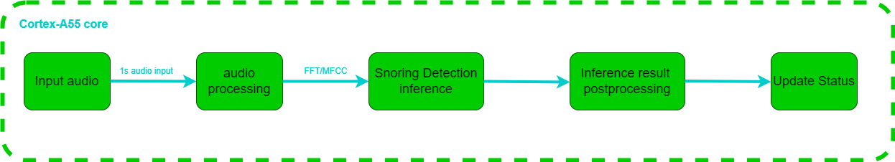
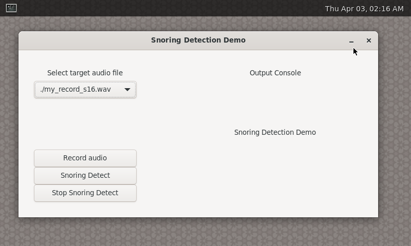
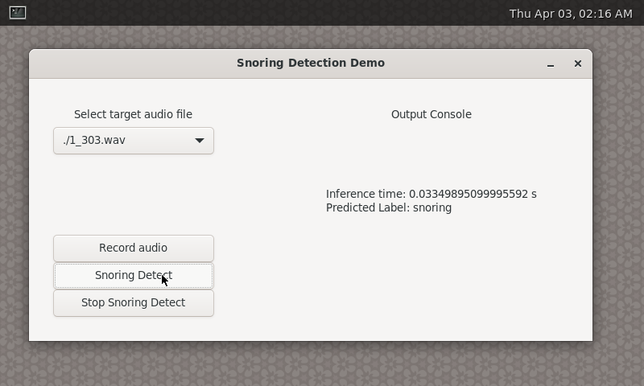
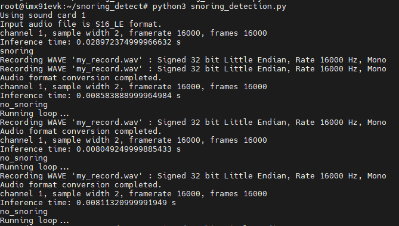
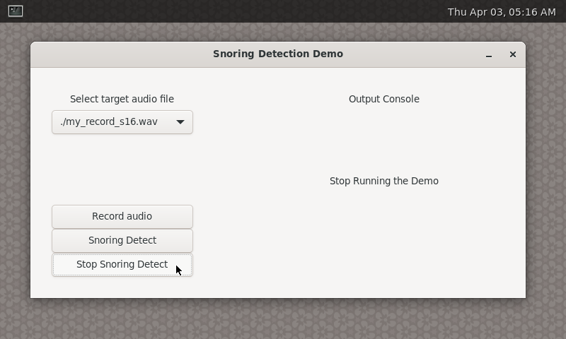
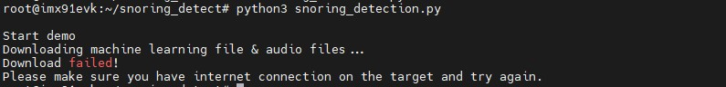
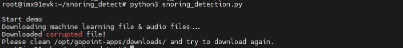

# i.MX 91 Snoring Detection

<!----- Boards ----->

 

NXP's *GoPoint for i.MX Applications Processors* unlocks a world of possibilities. This user-friendly app launches
pre-built applications packed with the Linux BSP, giving you hands-on experience with your i.MX SoC's capabilities.
Using the i.MX 91 EVKs you can run the included *Snoring detection* application available on GoPoint.
launcher as apart of the BSP flashed on to the board. For more information about GoPoint, please refer to
[GoPoint for i.MX Applications Processors User's Guide](https://www.nxp.com/IMXLINUX).

This Snoring Detection application showcases the i.MX 91's machine learning capabilities by using Cortex-A55 core to run ML model inference with tflite-micro framework.
## Table of Contents

1. [Software Architecture](#1-software-architecture)
2. [ML Models](#2-ML-models)
3. [Hardware](#3-hardware)
4. [Setup](#4-setup)
5. [Results](#5-results)
6. [FAQs](#6-faqs) 
7. [Support](#7-support)
8. [Revision History](#8-revision-history)

## 1 Software Architecture

*i.MX 91 Snoring Detection* runs on Cortex-A55 core, and do inference based on one second audio recording from microphone array on the EVK board. The simplied block diagram of work follow is shown below.

## 2 ML Models

For *Snoring Detection* application, the ML model takes audio data after Fast Fourier Transform(FFT) as input, and output the confidence of 2 classes: "snoring" and "no snoring".

More details about the model is listed below.

### Snoring Detection model

Information          | Value | Comment
---                  | ---   | ---
Input shape          | [1, 49, 64, 1] | FFT of audio data (quantized)
Input value range    | [-128, 127] | Int8
Output shape         | [1, 2] | Confidence of classes
MACs                 | 251.52 K
File size (INT8)     | 112 KB
Source framework     | [TensorFlow](https://www.tensorflow.org/tutorials/audio/simple_audio)
Origin               | Trained by NXP

### Benchmarks

The inference time on Cortex-A55 is measured using `./benchmark_model` tool and listed here as reference.

>**NOTE:** Evaluated with  BSP LF-6.6.52_2.2.0 on i.MX 91 EVK board

#### Snoring Detection model

CPU         | CPU Freq | Avg. Inference Time
---         | ---      | ---
Cortex-A55  | 1.4GHz   | 0.096 ms

## 3 Hardware

To run *Snoring Detection* on i.MX 91 EVK board, following hardware components are required.

Component |
---
Power Supply                
USB Type-C cable  (Type-A male to Type-C male)
LCD Display
Mouse

## 4 Setup

>**NOTE:** Users need to change the dtb into imx91-11x11-evk-tianma-wvga-panel.dtb to use the LCD display.

Launch GoPoint on the board and click on the **Snoring Detection** application shown in the launcher menu. Select the **Launch Demo** button to start it. Users can check the introduction shown in the launcher menu to understand the work process of each application.

Once the process starts, it first downloads application Machine Learning file and some prepared audio files from GoPoint github repository. If downloading is successful, machine learning model is loaded into Cortex-A55 to start the application. If you see the following UI, it means you have set up the demo successfully.

## 5 Results

After the demo is running, you can select the audio file which is also intergrated in the demo and then click the **Snoring Detect** button to detect, the output will show both on the screen and console log.

Also, you can record your own audio for detection, you can click the record audio and then you can see the recorded audio is saved in the dictory. Select your own audio file and click the snoring Detect button for Detection.

You can select the **none wave files** in the selection part. If you choose the *None wave files* and  click the *Snoring Detection*, the demo will loop through the recording and detecting process, and display the results on the screen and in the console log.

Click the **Stop snoring detection** to stop the detection.

## 6 FAQs

### How to exit the application

Users may encounter a situation where the UI interface occupies too much screen space. In this case, users need to use mouse to drag the application window aside to see the GoPoint launcher window. Then select the Stop Current Demo button to stop it.

### Why does a freeze occur every time I click the mouse or drag the UI interface?

Since the i.MX91 processor has only one Cortex-A55 core, and all operations including convolution will be run based on the CPU, there will be a slight lag, but it will not affect the result of the model inference.

### Fail to download machine learning file or audio files from server

Please make sure the internet connection is working on the board. The application requires an internet connection to download the models. If internet connection is available, please update the time and date of the board before trying to download the models again. Some servers might block the downloads for security reasons when the time and date of board is not updated. Some companies might also block their networks preventing the models to be downloaded. If this is the case, try using another connection such as a mobile device working as hotspot (Wi-Fi connection is required).

### Files are corrupted

It is possible that files get corrupted during download process due to different reasons, such as a connection shutdown. If this happens, the files won't be loaded to the application. To fix this, the easy solution is to clean the following path on the board: `/root/gopoint-apps/downloads`. Remove all files and try running the application again. If lucky, the files will be downloaded successfully next time.

## 7 Support

For more general technical questions, enter your questions on the [NXP Community Forum](https://community.nxp.com/)

## 8 Revision History

Version | Description                         | Date
---     | ---                                 | ---
1.0.0   | Initial release                     | April 7th 2025

## Licensing

*i.MX 91 Snoring Detection* is licensed under the [BSD-3-Clause License](https://spdx.org/licenses/BSD-3-Clause.html).

Models used in this application are licensed under [Apache-2.0 License](https://www.apache.org/licenses/LICENSE-2.0.html).