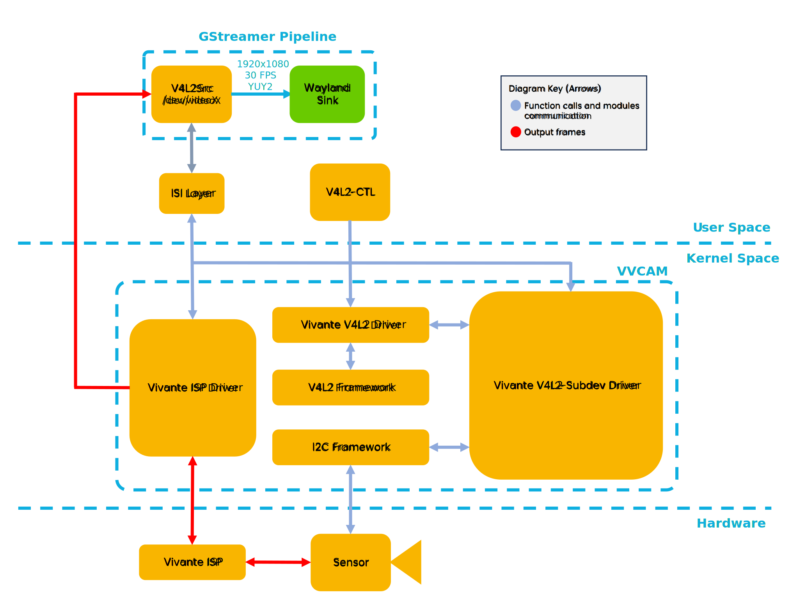
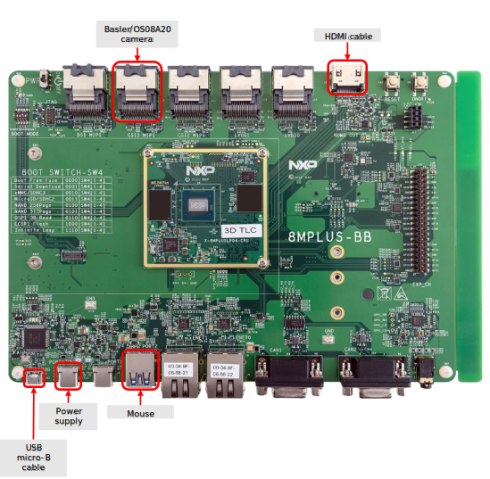
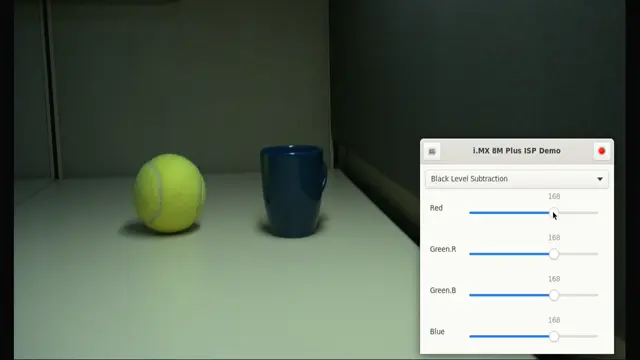

# ISP Control Example Application

<!----- Boards ----->

NXP's *GoPoint for i.MX Applications Processors* unlocks a world of possibilities.
This user-friendly app launches pre-built applications packed with the Linux BSP,
 giving you hands-on experience with your i.MX SoC's capabilities. Using the
 i.MX 8M Plus EVK you can run the included *ISP Control Example Application*
 available on GoPoint launcher as apart of the BSP flashed on to the board.
 For more information about GoPoint, please refer to
[GoPoint for i.MX Applications Processors User's Guide](https://www.nxp.com/IMXLINUX).

*ISP Control Example Application* showcases the *multimedia* capabilities of
 i.MX SoCs by launching a GStreamer pipeline that displays the current video
 feed and a window that allows users to change and manipulate it using API calls
 to the ISP (Image Signal Processor).

## Implementation Using GStreamer and V4L2-CTL

The Image Signal Processor (ISP) is a complete video and still picture input
 block. It contains image processing and color space conversion (RAW Bayer to YUV)
 functions. The integrated image processing unit supports simple CMOS sensors
 delivering RGB Bayer pattern without any integrated image processing and also
 image sensors with integrated YCbCr processing.

This example application uses the capabilites of this processor. First,
 a GStreamer pipeline is launched to display the output video from the
 connected camera. Once the pipeline is running, you can change some properties
 of the video feed by sending commands from the V4L2-CTL user application using
 a control panel. The VVCAM (i.MX 8M Plus ISP kernel driver integration) handles
 these commands and delivers image buffers to the GStreamer pipeline.

>**NOTE:** The above block diagram is simplified and does not represent the complete GStreamer pipeline or the complete ISP software architecture. Some elements were omitted and only key elements are shown.

The following options can currently be changed through the UI:
* Black level subtraction (red, green.r, green.b, blue).
* Dewarp.
    * Dewarp on/off
    * Change dewarp mode
    * Vertical and horizontal flip
* FPS limiting
* White balance
    * Auto white balance on/off
    * White balance control (red, green.r, green.b, blue)
* Color processing
    * Color processing on/off
    * Color processing control (brightness, contrast, saturation, and hue)
* Demosaicing
    * Demosaicing on/off
    * Color processing control (brightness, contrast, saturation, and hue)
    * Threshold control
* Threshold control
    * Gamma on/off
    * Gamma mode (logarithmic or equidistant)
* Filtering
    * Filter on/off
    * Filter control (denoise and sharpness)

## Table of Contents
1. [Software](#1-software)
2. [Hardware](#2-hardware)
3. [Setup](#3-setup)
4. [Results](#4-results)
5. [FAQs](#5-faqs)
6. [Support](#6-support)
7. [Release Notes](#7-release-notes)

## 1 Software

*ISP Control Example Application* is part of Linux BSP available at [Embedded Linux for i.MX Applications Processors](https://www.nxp.com/design/design-center/software/embedded-software/i-mx-software/embedded-linux-for-i-mx-applications-processors:IMXLINUX). All the required software and dependencies to run this application are already
 included in the BSP.

i.MX Board          | Main Software Components
---                 | ---
**i.MX 8M Plus EVK** | GStreamer

>**NOTE:** If you are building the BSP using Yocto Project instead of downloading the pre-built BSP, make sure
the BSP is built for *imx-image-full*, otherwise GoPoint is not included.

## 2 Hardware

To test *ISP Control Example Application*, the i.MX 8M Plus EVK is required with
 its respective hardware components.

Component                                         | i.MX 8M Plus
---                                               | :---:
Power Supply                                      | :white_check_mark:
HDMI Display                                      | :white_check_mark:
HDMI cable                                        | :white_check_mark:
USB micro-B cable (Type-A male to Micro-B male)   | :white_check_mark:
Basler/OS08A20 camera                             | :white_check_mark:
Mouse                                             | :white_check_mark:

## 3 Setup

Connect the Basler/OS08A20 camera to the first Mini-SAS MIPI-CSI Port.
 Connect the USB micro-B cable to the USB MicroB Debug Port and to your PC, and
 connect the mouse to the Type-A Port 2. Connect the power supply to the
 Type-C Port 0 and connect the HDMI cable to the HDMI Type-A Port and
 to your HDMI display. The following diagram shows how to make the necessary
 connections:

>**WARNING:** Please note that the MIPI-CSI Ports are not hot plug safe. If you plug or unplug the cameras while the board is powered on, you may damage the board.

For this application you need to change the device tree.
 To do that do the following:
 - Open the Arm Cortex-A core console as descibed in the Section 3:
  **Basic Terminal Setup** of the [i.MX Linux User's Guide](https://www.nxp.com/docs/en/user-guide/IMX_LINUX_USERS_GUIDE.pdf)
  , then press any key to enter U-Boot console.

 - There, enter the following command: `fatls mmc ${mmcdev}:${mmcpart}`.
  You should see a list of all available device tree files. Make sure
  the device trees **imx8mp-evk-basler.dtb** and **imx8mp-evk-os08a20.dtb**
  are listed.

 - Change the device tree using the `editenv fdtfile` command. Replace the
 .dtb file with **imx8mp-evk-basler.dtb** or **imx8mp-evk-os08a20.dtb**
 , depending on which camera you are using, and enter the `boot` command.

 - *Optional*. You can save this configuration using the `saveenv` command to
 the next time you use the board.

Launch GoPoint on the board and click on the *ISP Control Example Application*
 application shown in the launcher menu. Select the **Launch Demo** button to
 start it. A full-screen window shows up with the video source from the
 Basler/OS08A20 camera and a control panel after the video is started.

## 4 Results

When *ISP Control Example Application* starts running, the following is seen
 on the screen:

1. A full screen window showing the video source from the Basler/OS08A20 camera.
2. A window with a control panel to manipulate the video feed.

## 5 FAQs

### The example application does not run and just opens a window with the message "No compatible camera found! (Basler or OS08A20)"

This could be happening for 3 main reasons:
 1. You selected the wrong device tree file.
 2. There is a problem with your camera connection.
 3. The camera that you connected to the board is not the correct one
  (Basler or OS08A20).

 Make sure that the above scenarios are not the case.

## 6 Support

>**Warning**: For more general technical questions, enter your questions on the [NXP Community Forum](https://community.nxp.com/)

## 7. Release Notes

Version | Description                         | Date
---     | ---                                 | ---
1.0.0   | Initial release                     | June 28th 2024

## Licensing

*ISP Control Example Application* is licensed under the
 [BSD-3-Clause](https://opensource.org/license/bsd-3-clause).

## Origin

GStreamer documentation: https://gstreamer.freedesktop.org/documentation/index.html?gi-language=python \
Software ISP Application Note: https://www.nxp.com/docs/en/application-note/AN12060.pdf
