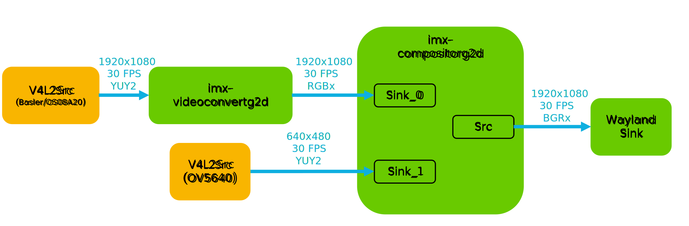
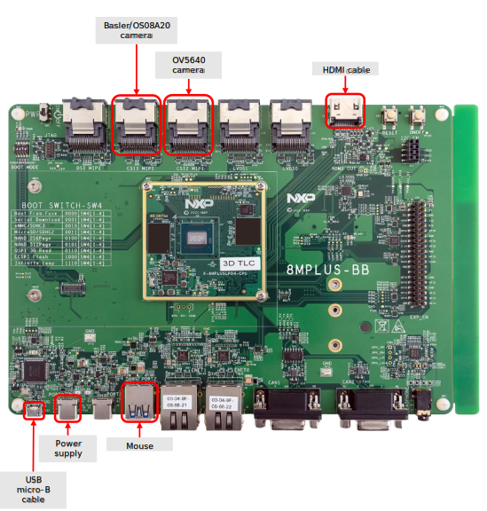
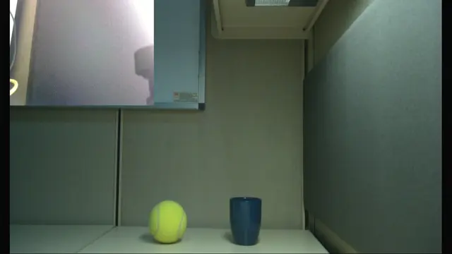

# Multi Cameras Preview

<!----- Boards ----->

NXP's *GoPoint for i.MX Applications Processors* unlocks a world of possibilities.
 This user-friendly app launches pre-built applications packed with the Linux BSP,
 giving you hands-on experience with your i.MX SoC's capabilities. Using
 the i.MX 8M Plus EVK you can run the included *Multi Cameras Preview* application
 available on GoPoint launcher as apart of the BSP flashed on to the board. For
 more information about GoPoint, please refer to
 [GoPoint for i.MX Applications Processors User's Guide](https://www.nxp.com/IMXLINUX).

*Multi Cameras Preview* showcases the *multimedia* capabilities of i.MX SoCs by
 launching a GStreamer pipeline that displays feed simultaneously from the
 Basler/OS08A20 and OV5640 cameras on the screen.

## Implementation Using GStreamer

In this application a GStreamer pipeline is implemented. First, the pipeline
 captures the input video frames from Basler/OS08A20 and 0V5640 cameras using
 the `v4l2src` element. The video input source from Basler camera is converted
 from YUY2 format to RGBx format by `imxvideoconvert_g2d` element
 (This element performs Color Space Conversion (CSC) using the 2D-GPU to speed up this process). Then, the `imxcompositor_g2d` perform the video compositing of both
 input videos (using the 2D-GPU as well) and the `waylandSink` element
 displays the output video on the screen.

>**NOTE:** This block diagram is simplified and does not represent the complete GStreamer pipeline. Some elements were omitted and only key elements are shown.

## Table of Contents
1. [Software](#1-software)
2. [Hardware](#2-hardware)
3. [Setup](#3-setup)
4. [Results](#4-results)
5. [FAQs](#5-faqs) 
6. [Support](#6-support)
7. [Release Notes](#7-release-notes)

## 1 Software

*Multi Cameras Preview* is part of Linux BSP available at [Embedded Linux for i.MX Applications Processors](https://www.nxp.com/design/design-center/software/embedded-software/i-mx-software/embedded-linux-for-i-mx-applications-processors:IMXLINUX).
 All the required software and dependencies to run this application are already
 included in the BSP.

i.MX Board           | Main Software Components
---                  | ---
**i.MX 8M Plus EVK** | GStreamer

>**NOTE:** If you are building the BSP using Yocto Project instead of downloading the pre-built BSP, make sure the BSP is built for *imx-image-full*, otherwise GoPoint is not included.

## 2 Hardware

To test *Multi Cameras Preview*, the i.MX 8M Plus EVK is required with its
 respective hardware components.

Component                                         | i.MX 8M Plus
---                                               | :---:
Power Supply                                      | :white_check_mark:
HDMI Display                                      | :white_check_mark:
HDMI cable                                        | :white_check_mark:
USB micro-B cable (Type-A male to Micro-B male)   | :white_check_mark:
Basler/OS08A20 camera                             | :white_check_mark:
OV5640 camera                                     | :white_check_mark:
Mouse                                             | :white_check_mark:

## 3 Setup

Connect the Basler/OS08A20 camera to the first Mini-SAS MIPI-CSI Port and
 the OV5640 camera to the second one. Connect the USB micro-B cable to the
 USB MicroB Debug Port and to your PC, and connect the mouse to the Type-A Port 2.
 Connect the power supply to the Type-C Port 0 and connect the HDMI cable to
 the HDMI Type-A Port and to your HDMI display.
 The following diagram shows how to make the necessary connections:

>**WARNING:** Please note that the MIPI-CSI ports are not hot plug safe. If you plug or unplug the cameras while the board is powered on, you may damage the board.

For this application you need to change the device tree file.
 To do that do the following:
 - Open the Arm Cortex-A core console as descibed in the Section 3:
 **Basic Terminal Setup** of the [i.MX Linux User's Guide](https://www.nxp.com/docs/en/user-guide/IMX_LINUX_USERS_GUIDE.pdf)
 , then press any key to enter to U-Boot console.

 - There, enter the following command: `fatls mmc ${mmcdev}:${mmcpart}`.
 You should see a list of all available device tree files. Make sure
 the device tree **imx8mp-evk-basler-ov5640.dtb** is listed.

 - Change the device tree using the `editenv fdtfile` command. Replace
 the .dtb file with **imx8mp-evk-basler-ov5640.dtb** and enter the `boot` command.

 - *Optional*. You can save this configuration using the `saveenv` command
 for the next time you use the board.

Launch GoPoint on the board and click on the *Multi Cameras Preview* application
 shown in the launcher menu. Select the **Launch Demo** button to start it.
 A full-screen window shows up with the video composition of both cameras.

## 4 Results

When *Multi Cameras Preview* starts running the following is seen on display:

1. A full screen window showing the video source from the Basler/OS08A20 camera.
2. At the upper left corner, in the same window, the video source from
 the OV5640 camera.

## 5 FAQs

### The example application does not run and just opens a window with the message "No video capture device was found" or "You need a Basler Camera and an OV5640 to run this example application"

This could be happening for 3 main reasons:
 1. You selected the wrong device tree file.
 2. There is a problem with your camera connections.
 3. The cameras that you connected to the board are not the correct ones
 (Basler/OS08A20 and OV5640).

 Make sure that the above scenarios are not the case.

## 6 Support

>**Warning**: For more general technical questions, enter your questions on the [NXP Community Forum](https://community.nxp.com/)

## 7. Release Notes

Version | Description                         | Date
---     | ---                                 | ---
1.0.0   | Initial release                     | June 28th 2024

## Licensing

*Multi Cameras Preview* is licensed under the [BSD-3-Clause](https://opensource.org/license/bsd-3-clause).

## Origin

GStreamer documentation: https://gstreamer.freedesktop.org/documentation/index.html?gi-language=python \
Set of GStreamer 1.0 plugings for NXP's i.MX platform: https://github.com/Freescale/gstreamer-imx