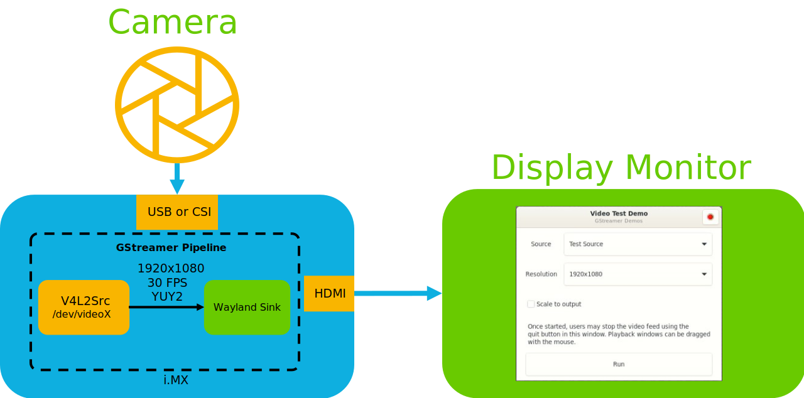
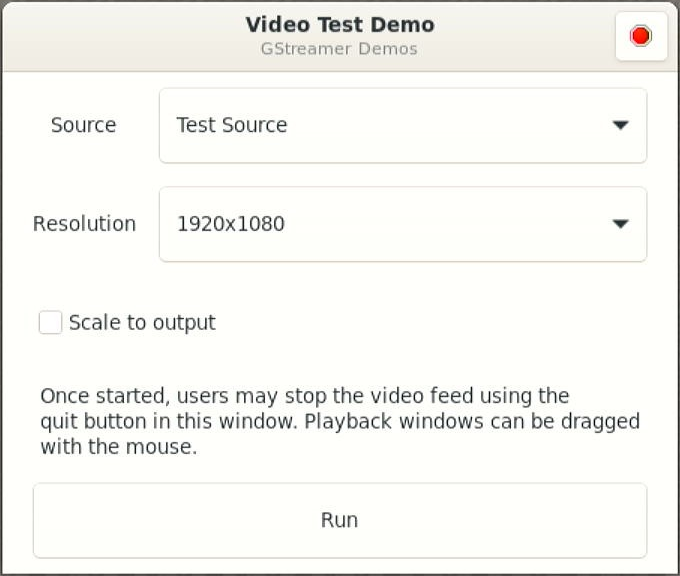

# Video test

<!----- Boards ----->

NXP's *GoPoint for i.MX Applications Processors* unlocks a world of possibilities. This user-friendly app launches
pre-built applications packed with the Linux BSP, giving you hands-on experience with your i.MX SoC's capabilities.
Using the i.MX 7ULP, i.MX 93 or i.MX 8 family processors you can run the included *video test* application available on GoPoint
launcher as apart of the BSP flashed on to the board. For more information about GoPoint, please refer to
[GoPoint for i.MX Applications Processors User's Guide](https://www.nxp.com/IMXLINUX).

[*Voice test*](https://github.com/nxp-imx-support/nxp-demo-experience-demos-list) was used as an example to test the gstreamer video, the resolution can be configurable.

## Table of Contents

- [Video test](#video-test)
  - [Table of Contents](#table-of-contents)
  - [1. Software](#1-software)
  - [2. Hardware](#2-hardware)
  - [3. Setup](#3-setup)
  - [4. Results](#4-results)
  - [5. Support](#5-support)
  - [6. Release Notes](#6-release-notes)
  - [Licensing](#licensing)

## 1. Software

*Video test* is part of Linux BSP available at [Embedded Linux for i.MX Applications Processors](https://www.nxp.com/design/design-center/software/embedded-software/i-mx-software/embedded-linux-for-i-mx-applications-processors:IMXLINUX). All the required software and dependencies to run this
application are already included in the BSP.

## 2. Hardware

To test *video test*, either the i.MX 7ULP, i.MX 93 or i.MX 8 family processors evks are required with their respective hardware components.

Component                                         | i.MX 7ULP        |i.MX 8M Plus      | i.MX 8QuadXPlus  and i.MX 8QuadMax |i.MX 8M Quad, i.MX 8M Mini and i.MX 8M Nano |i.MX 93 and i.MX 8ULP
---                                               | :---:            |:---:             | :---:                              | :---:                                      | :---:
Power Supply                                      |:white_check_mark:|:white_check_mark:|:white_check_mark:                  |:white_check_mark:                          |:white_check_mark:
HDMI Display                                      |:white_check_mark:|:white_check_mark:|:white_check_mark:                  |:white_check_mark:                          |:white_check_mark:
USB Type-C cable  (Type-A male to Type-C male)    |                  |:white_check_mark:|                                    |                                            |:white_check_mark:
USB micro-B cable  (Type-A male to Micro-B male)  |:white_check_mark:|                  |:white_check_mark:                  |:white_check_mark:                          |
HDMI cable                                        |:white_check_mark:|:white_check_mark:|:white_check_mark:                  |:white_check_mark:                          |:white_check_mark:
IMX-MIPI-HDMI (MIPI-DSI to HDMI adapter)          |                  |                  |:white_check_mark:                  |:white_check_mark:                          |:white_check_mark:
Mini-SAS cable                                    |                  |                  |:white_check_mark:                  |:white_check_mark:                          |:white_check_mark:
MIPI-CSI camera module                            |                  |:white_check_mark:|:white_check_mark:                  |:white_check_mark:                          |:white_check_mark:
USB camera (optional, if no MIPI-CSI camera used) |:white_check_mark:|:white_check_mark:|:white_check_mark:                  |:white_check_mark:                          |:white_check_mark:
Mouse                                             |:white_check_mark:|:white_check_mark:|:white_check_mark:                  |:white_check_mark:                          |:white_check_mark:
USB HUB type C                                    |:white_check_mark:|                  |:white_check_mark:                  |                                            |
USB Type-C female to USB Type-A Male              |:white_check_mark:|                  |:white_check_mark:                  |                                            |
USB Type-A Adapter (Type-A female to Type-C Male) |                  |:white_check_mark:|                                    |:white_check_mark:                          |:white_check_mark:

## 3. Setup

Launch GoPoint on the board, click on the *video test* application shown in the launcher menu. Select the **Launch Demo** button to start it. A window shows up to let the user select the camera source and resolution to be used.  

Make sure a camera module is connected, either MIPI-CSI or USB camera. Once detected and selected in the drop-down menu, start the application by clicking **Run**.

## 4. Results

When *video test* starts running the following is seen on display the video output that was used with the resolution selected.

 

## 5. Support

Questions regarding the content/correctness of this example can be entered as Issues within this GitHub repository.

>**Warning**: For more general technical questions, enter your questions on the [NXP Community Forum](https://community.nxp.com/)

## 6. Release Notes

Version | Description                         | Date
---     | ---                                 | ---
1.0.0   | Initial release                     | June 28th 2024

## Licensing

*Video test* is licensed under the [BSD-3-Clause](https://opensource.org/license/bsd-3-clause)